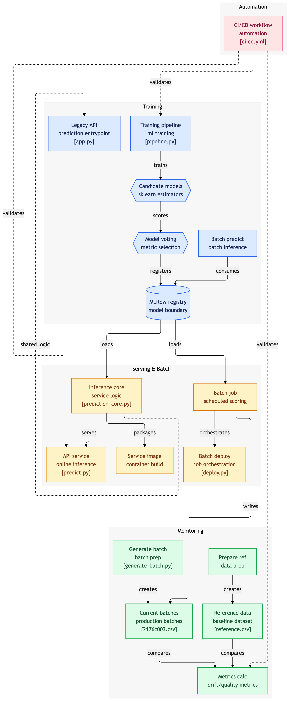

# Retail Store Inventory — Demand Forecasting

End-to-end MLOps project for forecasting daily product demand across retail stores. The system trains a regression model on historical sales data, serves predictions through a REST API, monitors for data drift in production, and ships every code change through an automated CI/CD pipeline.

**Goal:** Predict how many units of a product will be sold on a given day, given store context, pricing, weather, promotions, and seasonality.

---

## Architecture



The system has four pipelines that work together:
- **Training** builds candidate models, picks the best, and registers it in the MLflow registry.
- **Serving & Batch** loads the registered model and serves online predictions (`predict.py`) or scheduled batch jobs (`deploy.py`).
- **Monitoring** compares incoming production batches against a reference dataset to detect drift and performance degradation.
- **CI/CD automation** validates every code change with tests and ships the deployable service as a Docker image.

---

## Dataset

[Retail Store Inventory Forecasting Dataset](https://www.kaggle.com/datasets/anirudhchauhan/retail-store-inventory-forecasting-dataset) — 73,100 daily records spanning 2022–2024 across 5 stores and 20 products.

The dataset is not committed to this repository. Download `retail_store_inventory.csv` from Kaggle and place it in the project root before running any pipeline.

---

## Pipelines

### 1. Training pipeline — `training_pipeline/`

Trains and compares three regression models, picks the best one, and registers it in the MLflow Model Registry.

- **`pipeline.py`** — loads the data, filters to the 2022 training period, trains Linear Regression, Random Forest, and Gradient Boosting models, logs each as an MLflow experiment, and registers the best (by majority vote across MAE, RMSE, and R²) under the `Staging` alias.
- **`predict_pipeline.py`** — batch prediction script for scoring a CSV of new records using the registered model.
- **`app.py`** — local development version of the FastAPI prediction service, with Postgres logging for every request.

**Best model:** Gradient Boosting, with MAE ≈ 7.2, RMSE ≈ 8.4, R² ≈ 0.994 on the 2022 holdout.

### 2. Serving & batch pipeline — `dockerization_and_deployment/`

Two ways the trained model gets used in production.

**Webservice — `webservices/`**
- **`prediction_core.py`** — pure prediction logic (validation, preprocessing, model wrapper). The model is injected as a parameter, making the file fully unit-testable in CI without MLflow.
- **`predict.py`** — FastAPI app that loads the real model from the MLflow Registry and serves `/predict` requests.
- **`Dockerfile`** — packages `predict.py` into a portable container image.
- **`test_prediction_core.py`** — 17 unit tests run automatically in CI, using a `DummyModel` so no MLflow server is needed.
- **`test_predict.py`** — end-to-end sanity test, run manually with a live MLflow server.

**Batch scoring — `batch/`**
- **`train_predict_scheduled.py`** — Prefect flow that runs training and batch predictions on a schedule.
- **`deploy.py`** — deployment configuration for the Prefect flow.

### 3. Monitoring pipeline — `monitoring/`

Detects data drift and performance degradation by comparing production batches against a 2022 reference dataset.

- **`scripts/prepare_reference.py`** — builds the reference dataset from the 2022 training data.
- **`scripts/generate_batch.py`** — simulates production traffic from 2023+ data, with three configurable drift severity profiles (mild / medium / severe) to demonstrate the monitoring pipeline catches realistic distribution shifts.
- **`scripts/calculate_metrics.py`** — runs Kolmogorov–Smirnov drift tests per feature, computes regression metrics, and writes results to Postgres.
- **`test/test_calculate_metrics.py`** — 5 lightweight tests that pin the `FEATURES` contract.
- **`data/reference.csv`** — committed baseline (2022) data.
- **`data/current_batches/*.csv`** — example production batches with varying drift severities.

Metrics are stored in two Postgres tables (`metrics` for batch-level monitoring, `prediction_logs` for live API traffic) and visualized in two Grafana dashboards.

### 4. CI/CD pipeline — `.github/workflows/ci-cd.yml`

GitHub Actions workflow that automatically tests and deploys every change pushed to `main`.

- **CI job** — installs pinned dependencies, runs `test_prediction_core.py` (deployment tests) and `test_calculate_metrics.py` (monitoring tests), and syntax-checks `predict.py`.
- **CD job** — runs only if CI passed. Builds the Docker image from the webservice and pushes it to the GitHub Container Registry (`ghcr.io`).

The primary focus is the deployment pipeline; monitoring tests are included as a lightweight bonus safeguard.

---

## Project Structure

```
artifin/
├── .github/
│   └── workflows/
│       └── ci-cd.yml                      # CI/CD orchestration
├── dockerization_and_deployment/
│   ├── batch/
│   │   ├── deploy.py                      # Prefect deployment config
│   │   └── train_predict_scheduled.py     # Scheduled training flow
│   └── webservices/
│       ├── __init__.py
│       ├── Dockerfile                     # Container recipe
│       ├── predict.py                     # FastAPI service
│       ├── prediction_core.py             # Testable core logic
│       ├── test_predict.py                # End-to-end test (manual)
│       └── test_prediction_core.py        # 17 unit tests (run in CI)
├── monitoring/
│   ├── data/
│   │   ├── current_batches/               # Example production batches
│   │   │   ├── 2176c003.csv
│   │   │   ├── 3be089b9.csv
│   │   │   ├── 786ceb3f.csv
│   │   │   └── e3f3e39a.csv
│   │   └── reference.csv                  # 2022 baseline
│   ├── scripts/
│   │   ├── calculate_metrics.py
│   │   ├── generate_batch.py
│   │   └── prepare_reference.py
│   ├── test/
│   │   └── test_calculate_metrics.py      # 5 monitoring tests (run in CI)
│   ├── docker-compose.yml                 # Postgres, Adminer, Grafana
│   ├── Image.png
│   ├── pyproject.toml
│   └── README.md
├── training_pipeline/
│   ├── app.py                             # Local dev FastAPI service
│   ├── pipeline.py                        # Train + register best model
│   └── predict_pipeline.py                # Batch predictions
├── .gitignore
├── diagram.png                            # Architecture diagram
├── README.md
├── requirements.txt                       # Pinned dependencies
└── uv.lock
```

The `retail_store_inventory.csv` dataset, MLflow runs (`mlruns/`), and trained model artifacts (`models/`) are not committed — they're downloaded or generated locally.

---

## Tech Stack

| Component | Tool |
|---|---|
| Modeling | scikit-learn (Gradient Boosting, Random Forest, Linear Regression) |
| Experiment tracking & model registry | MLflow |
| Webservice | FastAPI + uvicorn |
| Batch orchestration | Prefect |
| Containerization | Docker |
| Monitoring storage | PostgreSQL |
| Monitoring visualization | Grafana + Adminer |
| Drift detection | SciPy (Kolmogorov–Smirnov test) |
| CI/CD | GitHub Actions + GitHub Container Registry |
| Testing | pytest |

---

## Running the Project

### 1. Install dependencies
```bash
pip install -r requirements.txt
```

### 2. Train the model
```bash
mlflow ui --port 5001                      # in a separate terminal
python training_pipeline/pipeline.py
```

### 3. Start the prediction service
```bash
uvicorn training_pipeline.app:app --reload --port 8001
# open http://127.0.0.1:8001/docs
```

### 4. Start monitoring infrastructure
```bash
cd monitoring
docker compose up -d                       # Postgres, Adminer, Grafana
```

### 5. Run the monitoring pipeline
```bash
export MLFLOW_TRACKING_URI="http://127.0.0.1:5001"
export POSTGRES_HOST=localhost POSTGRES_DB=monitoring \
       POSTGRES_USER=retail POSTGRES_PASSWORD=retail123

python monitoring/scripts/prepare_reference.py
python monitoring/scripts/generate_batch.py --size 200 --severity medium
python monitoring/scripts/calculate_metrics.py
```

Adminer at http://localhost:8080 (retail / retail123 / monitoring), Grafana at http://localhost:3000 (admin / admin).

### 6. Run the tests
```bash
pytest dockerization_and_deployment/webservices/test_prediction_core.py -v
pytest monitoring/test/test_calculate_metrics.py -v
```

---

## Drift Detection Approach

The model is trained only on **2022** data, and production batches are sampled from **2023+** — proper MLOps practice that prevents training on future data. Since the underlying dataset is synthetic and its distributions are stable across years, real temporal drift is minimal. To demonstrate the monitoring pipeline correctly detects drift when it occurs, controlled feature shifts are additionally injected on incoming batches via the `--severity` option in `generate_batch.py`. This simulates realistic production phenomena (supplier price changes, demand-forecast accuracy degradation, competitor pricing shifts).

The KS-based drift detector reliably catches all severity levels, with corresponding degradation in MAE, RMSE, and R² visible in the Grafana dashboard.
